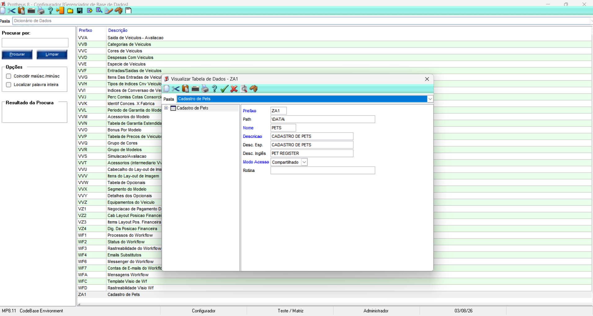
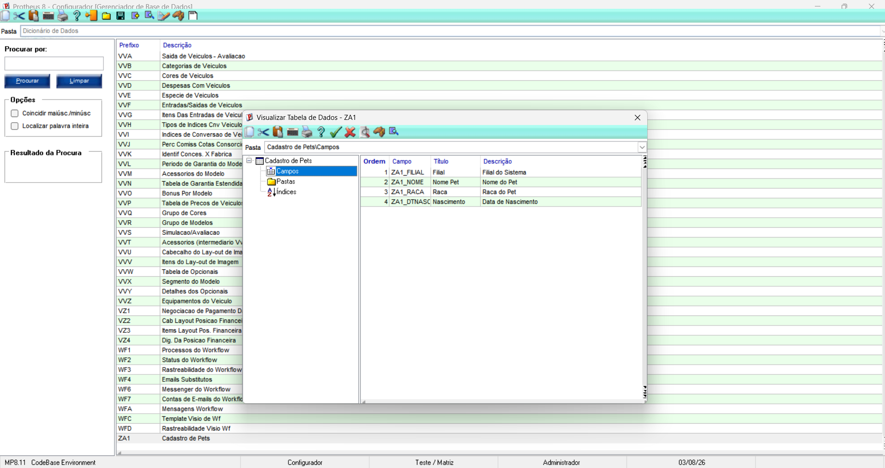
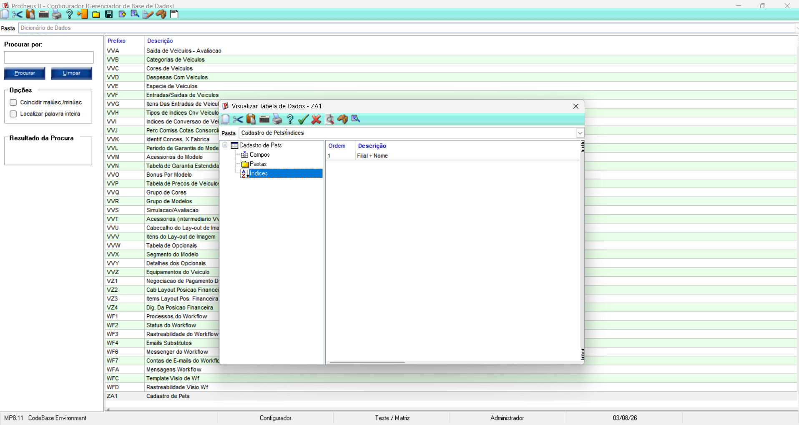

# Exercício 3 – Recriando a ZA1 no Configurador

## Objetivo

Recriar a tabela ZA1 (Cadastro de Pets) no Configurador do Protheus, criando sua estrutura, campos, índice, atualizando o Dicionário de Dados e validando sua criação no MPSDU.

## Estrutura da Tabela

Foi criada uma tabela customizada com as seguintes características:

- **Prefixo:** ZA1
- **Nome:** PETS
- **Descrição:** Cadastro de Pets
- **Modo de acesso:** Compartilhado

A estrutura foi cadastrada no **SX2**, responsável pelo cadastro das tabelas do sistema.

## Campos Criados

Os campos foram cadastrados no **SX3**, responsável pela definição dos campos das tabelas.

| Campo | Título | Descrição |
|-------|--------|-----------|
| ZA1_FILIAL | Filial | Filial do Sistema |
| ZA1_NOME | Nome Pet | Nome do Pet |
| ZA1_RACA | Raça | Raça do Pet |
| ZA1_DTNASC | Nascimento | Data de Nascimento |

## Criação do Índice

Foi criado um índice utilizando a chave:

**ZA1_FILIAL + ZA1_NOME**

Esse índice facilita a localização dos registros considerando a filial e o nome do pet.

## Atualização do Dicionário

Após concluir a criação da tabela, dos campos e do índice, executei a atualização do Dicionário de Dados.

A atualização foi concluída com sucesso, incluindo a nova estrutura da tabela ZA1.

## Reconhecimento da Tabela pelo Framework

Para que o framework reconhecesse a nova tabela e criasse o arquivo físico, utilizei uma fórmula contendo o comando:

```advpl
DBSelectArea("ZA1")
```

Após executar a fórmula, a tabela foi criada fisicamente no ambiente.

## Conferência no MPSDU

Após o reconhecimento da tabela pelo framework, conferi sua estrutura no MPSDU.

Foi possível verificar:

- a tabela física **PETS.DBF**;
- os campos cadastrados;
- o índice criado para a tabela.

## Evidências

Os prints anexados mostram:

- criação da tabela ZA1;
- criação dos campos;
- criação do índice;
- atualização do Dicionário de Dados;
- conferência da estrutura no MPSDU.

## Resultado

A tabela ZA1 foi criada com sucesso, atualizada no Dicionário de Dados, reconhecida pelo framework e validada no MPSDU, ficando disponível para utilização no Protheus.

# Evidências

## Estrutura da tabela ZA1



## Campos criados



## Índice criado


