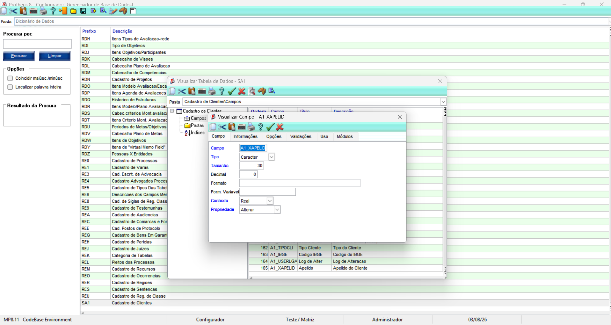
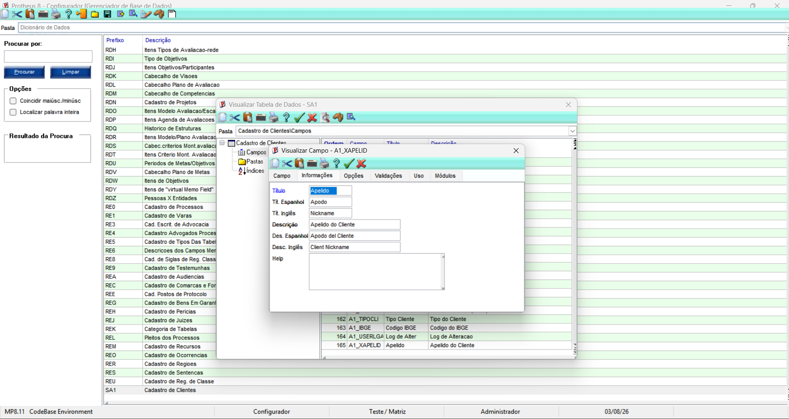
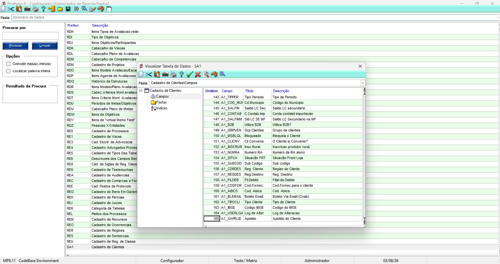

# Exercício 4 – Campo Customizado na SA1

## Objetivo

Criar um campo customizado na tabela SA1, utilizando o Configurador do Protheus, e confirmar que o novo campo foi incluído no Dicionário de Dados.

## Campo Criado

Foi criado o campo customizado com as seguintes características:

- **Campo:** A1_XAPELID
- **Tipo:** Character
- **Tamanho:** 30
- **Título:** Apelido
- **Descrição:** Apelido do Cliente
- **Contexto:** Real
- **Propriedade:** Alterar

## Informações Internacionais

Também foram preenchidas as informações em outros idiomas:

- **Título em espanhol:** Apodo
- **Título em inglês:** Nickname
- **Descrição em espanhol:** Apodo del Cliente
- **Descrição em inglês:** Client Nickname

## Configurações do Campo

O campo foi configurado da seguinte forma:

- não obrigatório;
- usado;
- exibido no Browse;
- disponível para todos os módulos;
- sem validação de usuário;
- sem inicializador padrão.

## Atualização do Dicionário

Após salvar o campo, executei a atualização do Dicionário de Dados.

A atualização incluiu o campo:

**A1_XAPELID – Apelido**

## Resultado

O campo customizado foi criado com sucesso na tabela SA1 e ficou disponível no Dicionário de Dados do Protheus.

# Evidências

## Detalhes do campo criado

## Informações do campo

## Campo incluído na tabela SA1

