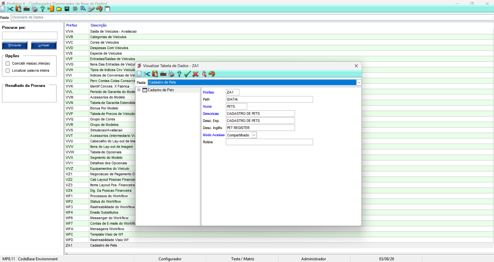
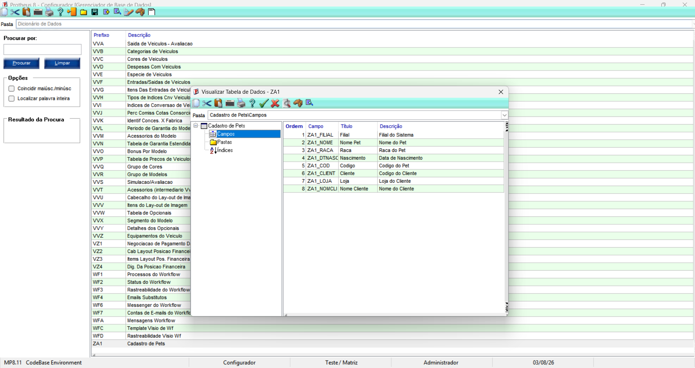
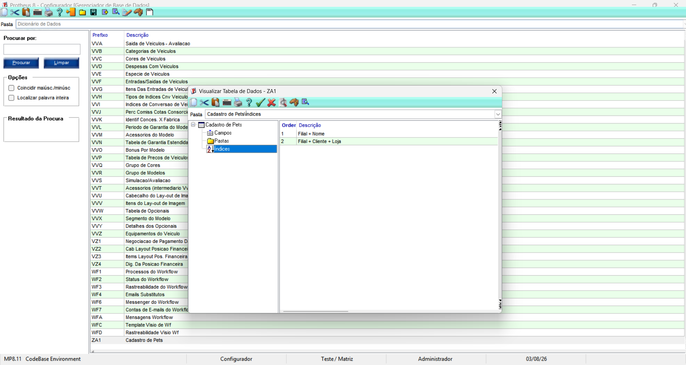

# Exercício 2 – Tabela ZA1

## Objetivo

A tabela ZA1 foi criada para armazenar o cadastro de pets dos clientes no Protheus.

## Estrutura da tabela

- Prefixo: ZA1
- Nome: Cadastro de Pets
- Modo de acesso: Compartilhado

## Campos utilizados

A tabela possui os seguintes campos:

- ZA1_FILIAL – Filial
- ZA1_NOME – Nome do Pet
- ZA1_RACA – Raça
- ZA1_DTNASC – Data de Nascimento
- ZA1_COD – Código do Pet
- ZA1_CLIENT – Código do Cliente
- ZA1_LOJA – Loja do Cliente
- ZA1_NOMCLI – Nome do Cliente (campo Virtual)

Também foi criado o índice **Filial + Cliente + Loja**, além do índice **Filial + Nome**.

## Evidências

### SX2 – Tabela ZA1

### SX3 – Campos

### SIX – Índices

## Conclusão

Durante o exercício foram adicionados novos campos à tabela ZA1, configurado o campo virtual ZA1_NOMCLI, criado um novo índice e atualizado o dicionário de dados, preparando a tabela para utilização pelos programas ADVPL.